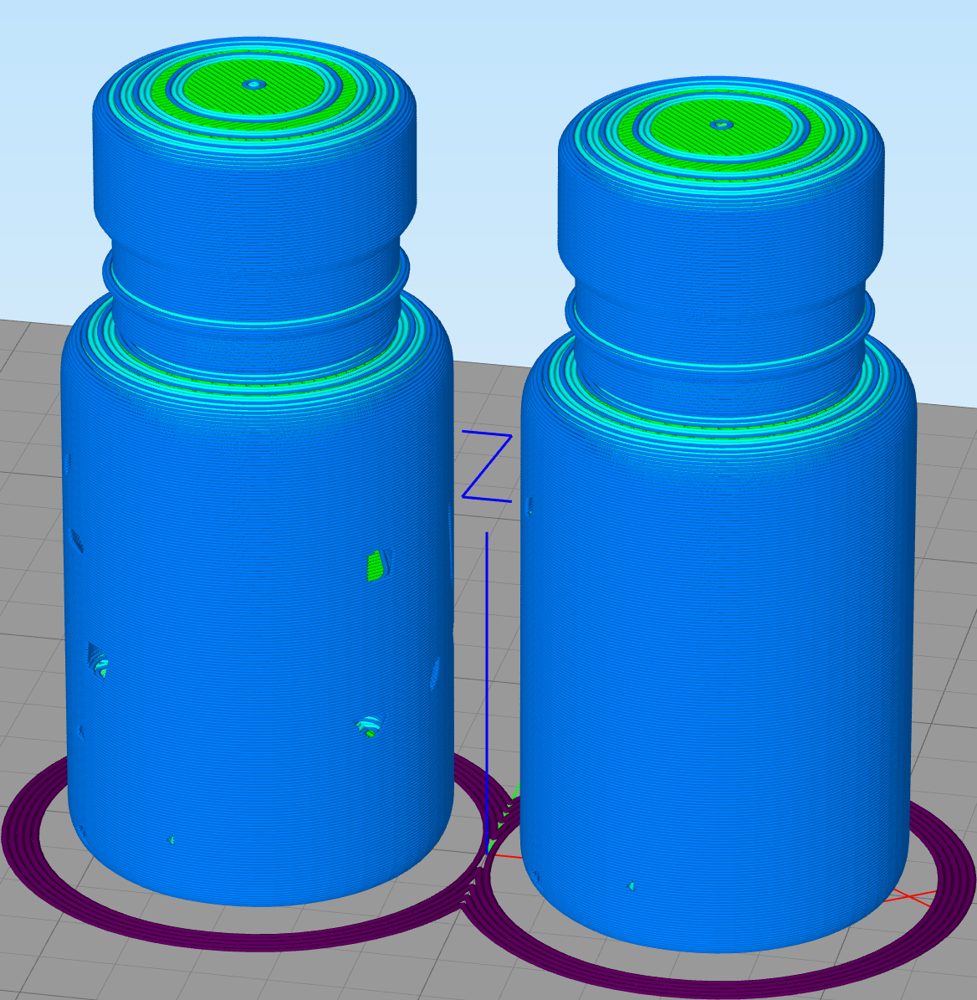

# 3dfix - A 3D printing file fixer upper

3dfix is an application that makes fixing 3D printing files more readily available on your local computer. You have a few options when it comes to fixing 3D printing files, such as online tools where you upload the files and then download the fixed version, netfabb, or Meshmixer, and others. 3dfix's aim is to allow you to do that locally via a console app and let you easily integrate 3D printing file fixing into your applications via the 3dfix.lib library.

Here's an example to demonstrate how 3dfix will fix your 3D printing files.  The bottle on the left is the broken model and the bottle on the right is the fixed model. As you can see, 3dfix will create surfaces that don't exist and remove interior complexity to make it more printer friendly.




## Important Notes

1. 3dfix is **Windows only** because it uses the [Windows.Graphics.Printing3D](https://docs.microsoft.com/uwp/api/windows.graphics.printing3d) APIs.
1. 3dfix only supports [.3mf files](https://3mf.io/) and following versions, `http://schemas.microsoft.com/3dmanufacturing/material/2015/02` and `http://schemas.microsoft.com/3dmanufacturing/core/2015/02`

      - We hope to add STL and other file format support in the near future.

## 3dfix console app

The 3dfix console app allows you to fix 3d printing files via the command line. It is made available as a [].NET Core global tool]() that you can install with the dotnet CLI.

### Install

#### Install .NET Core

Go here for .NET Core installation instructions: https://dotnet.microsoft.com/download (You only need the .NET Core Runtime, not the SDK, if you just want to run the tool)

#### Install 3dfix

`dotnet tool install --global 3dfix`

https://www.nuget.org/packages/3dfix/

### Usage

`3dfix -i INPUT_FILE_PATH` - Fixes file and appends `_fixed` to the fixed file name.

`3dfix -i INPUT_FILE_PATH -o OUTPUT_FILE_PATH` - Fixes file and outputs fixed file to the OUTPUT_FILE_PATH location.

## 3dfix library

The 3dfix.lib package allows you to fix 3d printing files via code.

### Install

`dotnet add package 3dfix.lib --version 1.0.1`

https://www.nuget.org/packages/3dfix.lib/

### Usage

```csharp
var fixer = new Fixer(inputFilePath);
await fixer.FixAsync();
```
